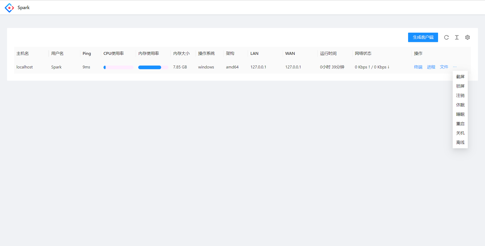
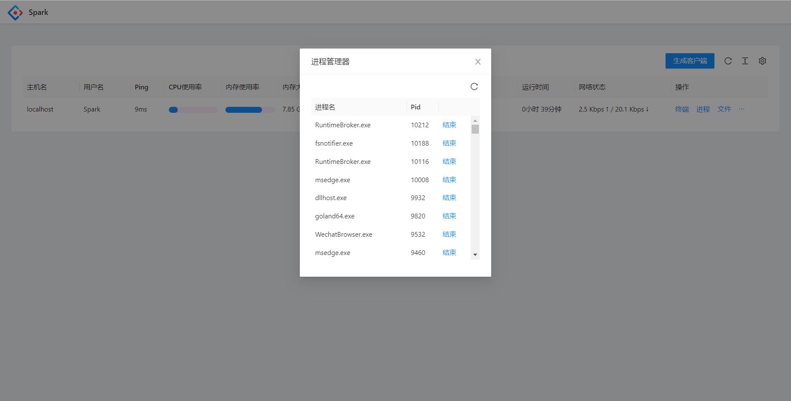
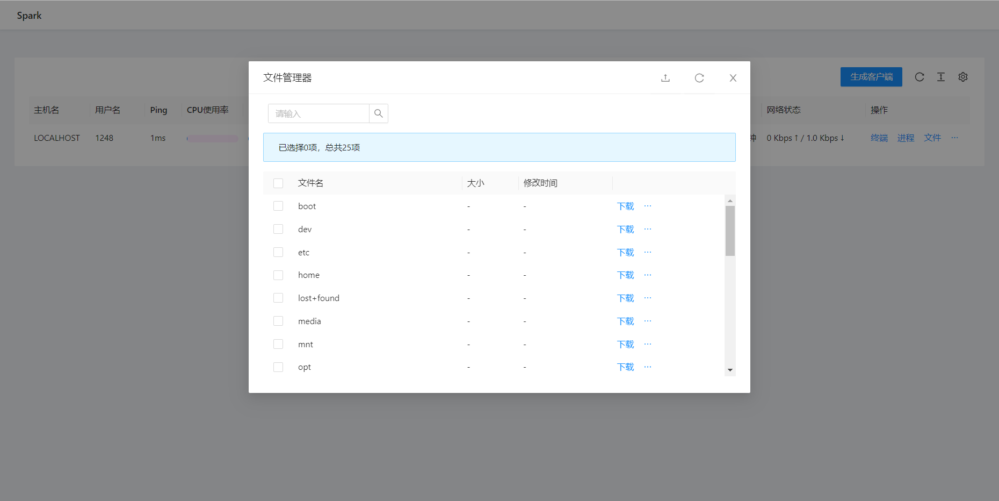

<h1 align="center">Spark</h1>

**Spark** 是一个免费、安全、开源、基于网页、跨平台且功能丰富的远程管理工具，可以让你通过浏览器，随时随地管理设备。

本项目**不**收集你的任何信息，无论是服务端或是客户端。因此，服务端永远不会自动更新，客户端永远只会与服务端通信。

### [[English]](./README.md) [中文] [[API Document]](./API.md) [[API文档]](./API.ZH.md)

---

### **免责声明**

**本项目及其源代码和发行版，旨在用于学习和交流。使用本项目所带来的风险由使用者本人承担。作者和开发者不会对你的错误使用而造成的损害承担任何责任。**

**数据无价，在点击任何按钮、输入任何命令之前，请三思。**

---

## **快速开始**

现在暂时只支持本地安装，暂时还没有Docker等安装方式。

### 本地安装

* 从 [Releases](https://github.com/XZB-1248/Spark/releases) 页面下载对应系统的可执行文件。
* 在目录下创建一个名为`Config.json`的配置文件，修改其中的信息。

  ```json
  {
	  "listen": ":8000",
	  "salt": "some random string",
	  "auth": {
		  "username": "password"
	  }
  }
  ```

* 修改完成后运行服务端，然后打开 IP:端口。
* 在管理页面中生成客户端，并部署到设备上。
* 现在就可以控制这个设备了。

---

## **特性**

| 特性/OS | Windows | Linux | MacOS |
|-------|---------|-------|-------|
| 进程管理  | ✔       | ✔     | ✔     |
| 结束进程  | ✔       | ✔     | ✔     |
| 网络状态  | ✔       | ✔     | ✔     |
| 文件浏览  | ✔       | ✔     | ✔     |
| 文件传输  | ✔       | ✔     | ✔     |
| 删除文件  | ✔       | ✔     | ✔     |
| 系统信息  | ✔       | ✔     | ✔     |
| 远程终端  | ✔       | ✔     | ✔     |
| 屏幕快照  | ✔       | ✔     | ✔     |
| * 关机  | ✔       | ✔     | ✔     |
| * 重启  | ✔       | ✔     | ✔     |
| * 休眠  | ✔       | ❌     | ❌     |
| * 睡眠  | ✔       | ❌     | ❌     |
| * 注销  | ✔       | ❌     | ❌     |
| * 锁屏  | ✔       | ❌     | ❌     |

* 空单元格代表目前暂未测试。
* 星号代表该功能可能需要管理员或root权限才能使用。

---

## **开发**

### 注意

本项目由三个部分组成，你必须把它们都编译一下。

如果你不想陷入无止尽的安装、配置的过程，建议去 [快速开始](#快速开始) 。

* 客户端
* 服务端
* 前端页面

如果要让客户端支持除了Linux和Windows之外的系统，你必须要安装对应的C交叉编译工具链。

例如，如果要给Android系统编译客户端，那就必须安装 [Android NDK](https://developer.android.com/ndk/downloads) 。

### 指南

```bash
# Clone该项目
$ git clone https://github.com/XZB-1248/Spark


$ cd ./Spark


# 开始编译前端页面
$ cd ./web
# 安装所有的依赖，然后编译。
$ npm install
$ npm run build-prod


# 通过statik，将前端文件嵌入到服务端里。
$ cd ..
$ go install github.com/rakyll/statik
$ statik -m -src="./web/dist" -f -dest="./server/embed" -p web -ns web


# 开始编译客户端。
# 在使用类Unix系统时，运行以下命令。
$ go mod tidy
$ go mod download
$ ./build.client.sh
$ statik -m -src="./built" -f -dest="./server/embed" -include=* -p built -ns built


# 最终开始编译服务端。
$ ./build.server.sh
```

然后打开`releases`目录，放入上文提到的配置文件，选择对应平台的服务端运行即可。

---

## 截图








---

## 项目依赖

Spark使用了许多第三方的开源项目。

依赖列表可以在 `go.mod` 和 `package.json` 里面找到。

一些主要的依赖项如下列所示。

### 后端

* [Go](https://github.com/golang/go) ([License](https://github.com/golang/go/blob/master/LICENSE))

* [gin-gonic/gin](https://github.com/gin-gonic/gin) (MIT License)

* [imroc/req](https://github.com/imroc/req) (MIT License)

* [kbinani/screenshot](https://github.com/kbinani/screenshot) (MIT License)

* [shirou/gopsutil](https://github.com/shirou/gopsutil) ([License](https://github.com/shirou/gopsutil/blob/master/LICENSE))

* [gorilla/websocket](https://github.com/gorilla/websocket) (BSD-2-Clause License)

* [olahol/melody](https://github.com/olahol/melody) (BSD-2-Clause License)

* [orcaman/concurrent-map](https://github.com/orcaman/concurrent-map) (MIT License)

### 前端

* [React](https://github.com/facebook/react) (MIT License)

* [Ant-Design](https://github.com/ant-design/ant-design) (MIT License)

* [axios](https://github.com/axios/axios) (MIT License)

* [xterm.js](https://github.com/xtermjs/xterm.js) (MIT License)

* [crypto-js](https://github.com/brix/crypto-js) (MIT License)

---

## 开源协议

本项目基于 [BSD-2 协议](./LICENSE) 。