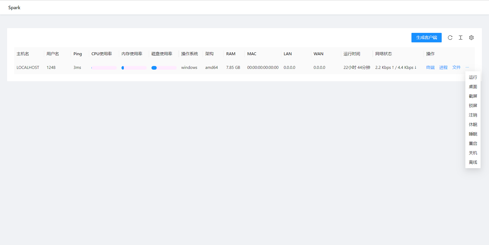
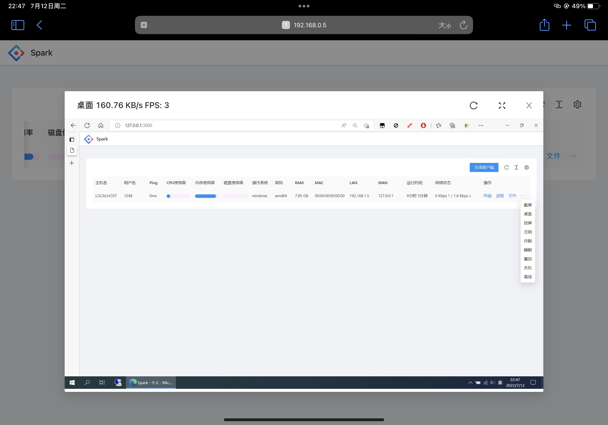
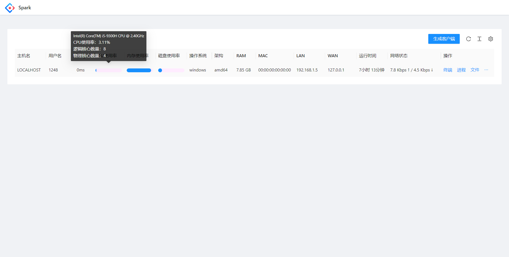

#### [[English]](./README.md) [中文] [[API Document]](./API.md) [[API文档]](./API.ZH.md)

---

<h1>Spark</h1>

**Spark** 是一个免费、安全、开源、基于网页、跨平台且功能丰富的远程管理工具，可以让你通过浏览器，随时随地管理设备。

✅ **不收集数据**: Spark不会收集任何用户数据。  
✅ **不自动更新**: 服务端不会在任何情况下进行自动更新。  
✅ **直接通信**: 客户端永远只会和你的服务器通信，隐私优先。

---


|  |  |  |
|--------------------------------------------------------------------------------------------------------|-----------------------------------------------------------------------------------------|-------------------------------------------------------------------------------------------------------|

| [](https://github.com/XZB-1248/Spark/releases) | [](https://github.com/XZB-1248/Spark/releases/latest) |
|---------------------------------------------------------------------------------------------------------------------------------------------------|--------------------------------------------------------------------------------------------------------------------------------------------------------------------------------|

---

## ⚠️ 免责声明

**本项目及其源代码和发行版，旨在用于学习和交流。**

❌ **禁止用于任何非法用途！**  
❌ **使用本项目所带来的风险由使用者本人承担。**  
✅ **作者和开发者不会对你错误使用而造成的损害承担任何责任。**

如果你发现了任何安全问题，请**不要**发布issue，并立即[联系我](mailto:i@1248.ink)。

---

## 🚀 快速开始

### 二进制运行

1. 在[releases](https://github.com/XZB-1248/Spark/releases)中下载二进制文件。
2. 按照[配置文件说明](#配置文件)，设置好配置文件。
3. 运行服务端，访问`IP:端口`，例如 `http://localhost:8000/` 。
4. 在管理页面中生成客户端，并部署到目标设备上。
5. 开始控制目标设备。

---

## ⚙️ 配置文件

在服务端的根目录下，创建`config.json`文件，按照以下格式填写：

  ```json
  {
      "listen": ":8000",
      "salt": "123456abcdef",
      "auth": {
          "username": "password"
      },
      "log": {
          "level": "info",
          "path": "./logs",
          "days": 7
      }
  }
  ```

- **`listen`**（必填），格式为 `IP:端口`
- **`salt`**（必填），长度不大于**24**的随机字符串，修改后需要**重新部署所有客户端**
- **`auth`**（选填），格式为 `用户名:密码`
  - 密码强烈建议使用hash加密（格式为`$算法$密文`，例如`$sha256$11223344556677AABBCCDDEEFF`）
  - 支持的算法有：`sha256`，`sha512`和`bcrypt`
- **`log`**（选填），日志配置
  - `level`日志等级，可选值：`disable`, `fatal`, `error`, `warn`, `info`, `debug`
  - `path`日志保存目录（默认为`./logs`）
  - `days`日志保存天数（默认为`7`）

---

## 🛠️ 特性

| 特性/OS | Windows | Linux | MacOS |
|-------|---------|-------|-------|
| 进程管理  | ✔       | ✔     | ✔     |
| 结束进程  | ✔       | ✔     | ✔     |
| 网络状态  | ✔       | ✔     | ✔     |
| 文件浏览  | ✔       | ✔     | ✔     |
| 文件传输  | ✔       | ✔     | ✔     |
| 文件编辑  | ✔       | ✔     | ✔     |
| 删除文件  | ✔       | ✔     | ✔     |
| 代码高亮  | ✔       | ✔     | ✔     |
| 屏幕监控  | ✔       | ✔     | ✔     |
| 屏幕快照  | ✔       | ✔     | ✔     |
| 系统信息  | ✔       | ✔     | ✔     |
| 远程终端  | ✔       | ✔     | ✔     |
| * 关机  | ✔       | ✔     | ✔     |
| * 重启  | ✔       | ✔     | ✔     |
| * 注销  | ✔       | ❌     | ✔     |
| * 睡眠  | ✔       | ❌     | ✔     |
| * 休眠  | ✔       | ❌     | ❌     |
| * 锁屏  | ✔       | ❌     | ❌     |

🚨 **星号代表该功能可能需要管理员或root权限才能使用。**

---

## 📸 截图










---

## 🔧 开发

### 组件
本项目由三个部分组成：
- **客户端**
- **服务端**
- **前端**

如果要让客户端支持除了Linux和Windows之外的系统，你必须要安装对应的C交叉编译工具链。  
例如，如果要给Android系统编译客户端，那就必须安装 [Android NDK](https://developer.android.com/ndk/downloads) 。

### 指南

```bash
# Clone项目
$ git clone https://github.com/XZB-1248/Spark
$ cd ./Spark


# 编译前端
$ cd ./web
$ npm install
$ npm run build-prod


# 服务端嵌入静态资源
$ cd ..
$ go install github.com/rakyll/statik
$ statik -m -src="./web/dist" -f -dest="./server/embed" -p web -ns web


# 编译客户端
$ mkdir ./built
$ go mod tidy
$ go mod download
$ ./scripts/build.client.sh


# 编译服务端
$ mkdir ./releases
$ ./scripts/build.server.sh
```

---

## 功能定制

如果需要二次开发/功能定制，请联系[**i@1248.ink**](mailto:i@1248.ink)。

---

## 项目依赖

Spark使用了许多第三方的开源项目。

依赖列表可以在 `go.mod` 和 `package.json` 里面找到。

一些主要的依赖项如下列所示。

### 后端

* [Go](https://github.com/golang/go) ([License](https://github.com/golang/go/blob/master/LICENSE))

* [gin-gonic/gin](https://github.com/gin-gonic/gin) (MIT License)

* [imroc/req](https://github.com/imroc/req) (MIT License)

* [kbinani/screenshot](https://github.com/kbinani/screenshot) (MIT License)

* [shirou/gopsutil](https://github.com/shirou/gopsutil) ([License](https://github.com/shirou/gopsutil/blob/master/LICENSE))

* [gorilla/websocket](https://github.com/gorilla/websocket) (BSD-2-Clause License)

* [olahol/melody](https://github.com/olahol/melody) (BSD-2-Clause License)

* [orcaman/concurrent-map](https://github.com/orcaman/concurrent-map) (MIT License)

### 前端

* [React](https://github.com/facebook/react) (MIT License)

* [Ant-Design](https://github.com/ant-design/ant-design) (MIT License)

* [axios](https://github.com/axios/axios) (MIT License)

* [xterm.js](https://github.com/xtermjs/xterm.js) (MIT License)

* [crypto-js](https://github.com/brix/crypto-js) (MIT License)

### 感谢

* [natpass](https://github.com/lwch/natpass) (MIT License)
* 图像差异部分参考了natpass项目的有关逻辑。

---

### Star趋势

[](https://starchart.cc/XZB-1248/Spark)

---
## 📜 开源协议

本项目基于 [BSD-2 协议](./LICENSE) 。
