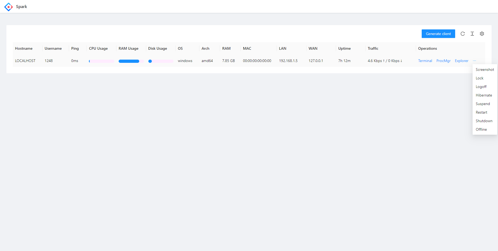
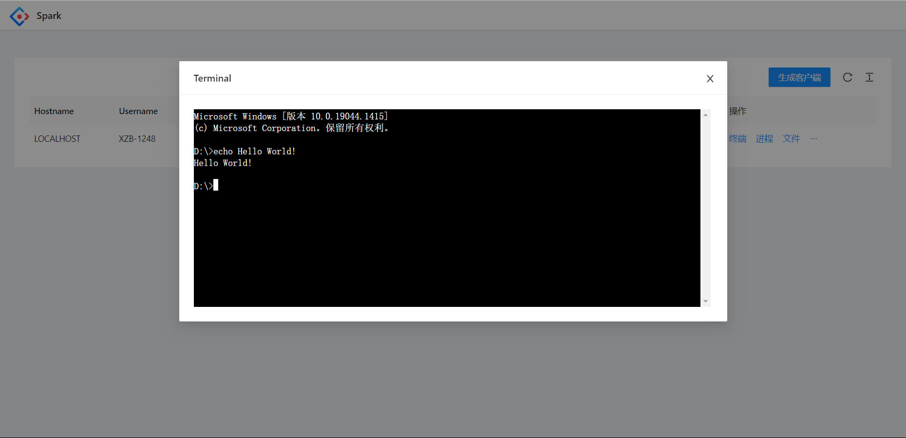
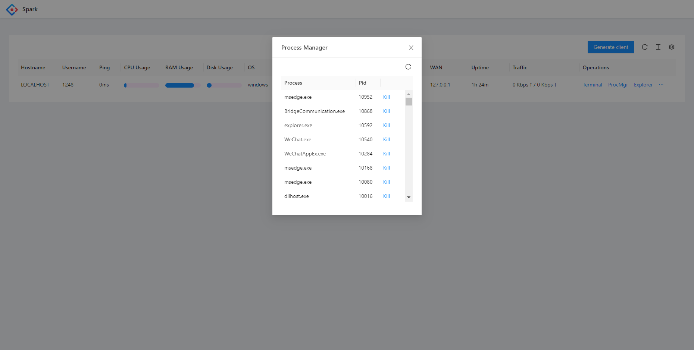
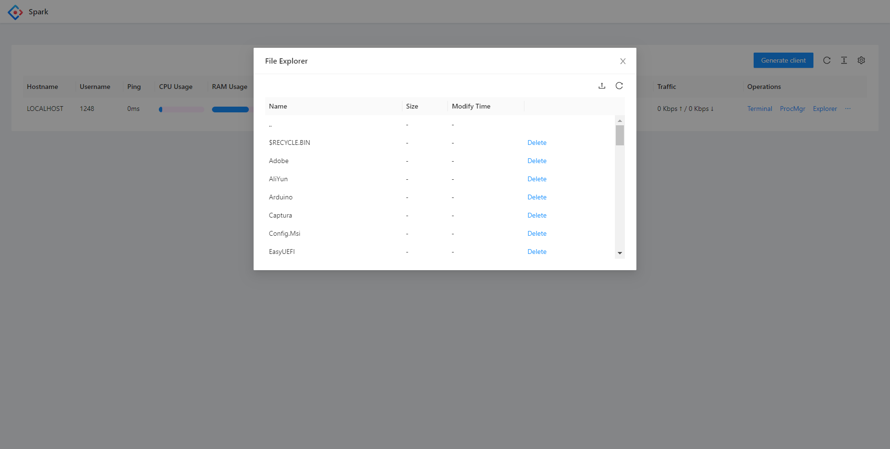

<h1 align="center">Spark</h1>

**Spark** is a free, safe, open-source, web-based, cross-platform and full-featured RAT (Remote Administration Tool)
that allow you to control all your devices via browser anywhere.

We **won't** collect any data, thus the server will never self-upgrade. Your clients will only communicate with your
server forever.

### [English] [[中文]](./README.ZH.md) [[API Document]](./API.md) [[API文档]](./API.ZH.md)

---

<div align="center">

||||
|-|-|-|

|[](https://github.com/XZB-1248/Spark/releases)|[](https://github.com/XZB-1248/Spark/releases/latest)|
|-|-|

</div>

---

## **Disclaimer**

**THIS PROJECT, ITS SOURCE CODE, AND ITS RELEASES SHOULD ONLY BE USED FOR EDUCATIONAL PURPOSES.**
<br />
**YOU SHALL USE THIS PROJECT AT YOUR OWN RISK.**
<br />
**THE AUTHORS AND DEVELOPERS ARE NOT RESPONSIBLE FOR ANY DAMAGE CAUSED BY YOUR MISUSE OF THIS PROJECT.**

**YOUR DATA IS PRICELESS. THINK TWICE BEFORE YOU CLICK ANY BUTTON OR ENTER ANY COMMAND.**

---

## **Quick start**

Only local installation are available yet.

### Local installation
* Get prebuilt executable file from [Releases](https://github.com/XZB-1248/Spark/releases) page.
* Extract all files and **do not** delete `built` directory.
* Create a configuration file named `Config.json` and set your own salt.

  ```json
  {
      "listen": ":8000",
      "salt": "some random string",
      "auth": {
          "username": "password"
      }
  }
  ```

* Run it and browse the address:port you've just set, for example: `http://localhost:8000/`.
* Generate client online and execute it on your device.
* Now you can control your device.

---

## **Features**

| Feature/OS      | Windows | Linux | MacOS |
|-----------------|---------|-------|-------|
| Process manager | ✔       | ✔     | ✔     |
| Kill process    | ✔       | ✔     | ✔     |
| Network traffic | ✔       | ✔     | ✔     |
| File explorer   | ✔       | ✔     | ✔     |
| File transfer   | ✔       | ✔     | ✔     |
| File editor     | ✔       | ✔     | ✔     |
| Delete file     | ✔       | ✔     | ✔     |
| Code highlight  | ✔       | ✔     | ✔     |
| Desktop monitor | ✔       | ✔     | ✔     |
| Screenshot      | ✔       | ✔     | ✔     |
| OS info         | ✔       | ✔     | ✔     |
| Terminal        | ✔       | ✔     | ✔     |
| * Shutdown      | ✔       | ✔     | ✔     |
| * Reboot        | ✔       | ✔     | ✔     |
| * Log off       | ✔       | ❌     | ✔     |
| * Sleep         | ✔       | ❌     | ✔     |
| * Hibernate     | ✔       | ❌     | ❌     |
| * Lock screen   | ✔       | ❌     | ❌     |

* Blank cell means the situation is not tested yet.
* The Star symbol means the function may need administration or root privilege.

---

## Screenshots











---

## **Development**

### note

There are three components in this project, so you have to build them all.

Go to [Quick start](#quick-start) if you don't want to make yourself boring.

* Client
* Server
* Front-end

If you want to make client support OS except linux and windows, you should install some additional C compiler.

For example, to support android, you have to install [Android NDK](https://developer.android.com/ndk/downloads).

### tutorial

```bash
# Clone this repository.
$ git clone https://github.com/XZB-1248/Spark
$ cd ./Spark


# Here we're going to build front-end pages.
$ cd ./web
# Install all dependencies and build.
$ npm install
$ npm run build-prod


# Embed all static resources into one single file by using statik.
$ cd ..
$ go install github.com/rakyll/statik
$ statik -m -src="./web/dist" -f -dest="./server/embed" -p web -ns web


# Now we should build client.
# When you're using unix-like OS, you can use this.
$ mkdir ./built
$ go mod tidy
$ go mod download
$ ./scripts/build.client.sh


# Finally we're compiling the server side.
$ mkdir ./releases
$ ./scripts/build.server.sh
```

Then create a new directory with a name you like.
<br />
Copy executable file inside `releases` to that directory.
<br />
Copy the whole `built` directory to that new directory.
<br />
Copy configuration file mentioned above to that new directory.
<br />
Finally, run the executable file in that directory.

---

## Dependencies

Spark contains many third-party open-source projects.

Lists of dependencies can be found at `go.mod` and `package.json`.

Some major dependencies are listed below.

### Back-end

* [Go](https://github.com/golang/go) ([License](https://github.com/golang/go/blob/master/LICENSE))

* [gin-gonic/gin](https://github.com/gin-gonic/gin) (MIT License)

* [imroc/req](https://github.com/imroc/req) (MIT License)

* [kbinani/screenshot](https://github.com/kbinani/screenshot) (MIT License)

* [shirou/gopsutil](https://github.com/shirou/gopsutil) ([License](https://github.com/shirou/gopsutil/blob/master/LICENSE))

* [gorilla/websocket](https://github.com/gorilla/websocket) (BSD-2-Clause License)

* [orcaman/concurrent-map](https://github.com/orcaman/concurrent-map) (MIT License)

### Front-end

* [React](https://github.com/facebook/react) (MIT License)

* [Ant-Design](https://github.com/ant-design/ant-design) (MIT License)

* [axios](https://github.com/axios/axios) (MIT License)

* [xterm.js](https://github.com/xtermjs/xterm.js) (MIT License)

* [crypto-js](https://github.com/brix/crypto-js) (MIT License)

### Acknowledgements

* [natpass](https://github.com/lwch/natpass) (MIT License)
* Image difference algorithm inspired by natpass.

---

### Stargazers over time

[](https://starchart.cc/XZB-1248/Spark)

---

## License

[BSD-2 License](./LICENSE)